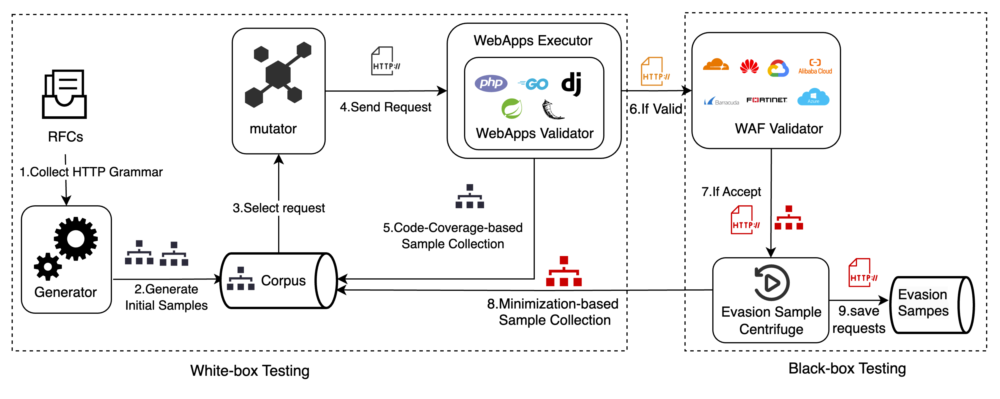

# WAFManis

*WAFManis* is a protocol-level WAF evasion mining framework to discover the parsing ambiguities between WAF and Web Application.



## Usage

In this repo, we place our webapp validators and the waf validator. These web validator are configured to accept taint parameter in form paramters by default.

Currently, we have released our python fuzzer developed with [atheris](https://github.com/google/atheris/) and our generator and mutator module. You can get more detail in its [README.md](./fuzzer/atheris_fuzzer/README.md).

## How to cite us?

This framework is based on our latest research,"Break the Wall from bottom: Automated Discovery of Protocol-Level Evasion Vulnerabilities in Web Application Firewalls", accepted at S&P '24.

If you want to cite us, please use the following (BibTeX) reference:

```
@INPROCEEDINGS {,
    author = {Q. Wang and J. Chen and Z. Jiang and R. Guo and X. Liu and C. Zhang and H. Duan},
    booktitle = {2024 IEEE Symposium on Security and Privacy (SP)},
    title = {Break the Wall from bottom: Automated Discovery of Protocol-Level Evasion Vulnerabilities in Web Application Firewalls},
    year = {2024},
    volume = {},
    issn = {2375-1207},
    pages = {128-128},
    keywords = {waf;fuzz;protocol-level waf evasion;security},
    doi = {10.1109/SP54263.2024.00129},
    url = {https://doi.ieeecomputersociety.org/10.1109/SP54263.2024.00129},
    publisher = {IEEE Computer Society},
    address = {Los Alamitos, CA, USA},
    month = {may}
}
```

## Disclaimer

Do not attempt to use these tools to violate the law. The author is not responsible for any illegal action. Misuse of the provided information can result in criminal charges.
